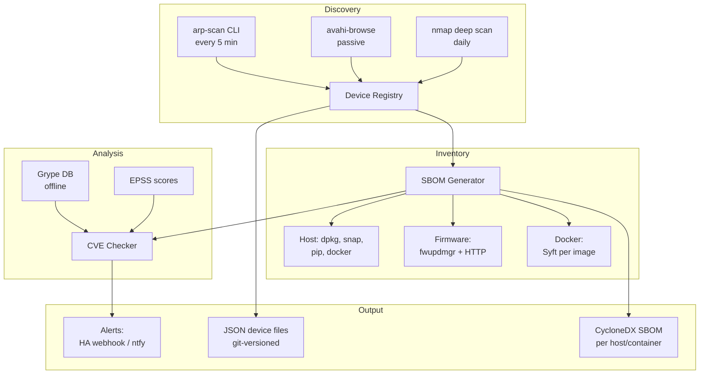

# Design: Network SBOM + CMDB + CVE Monitoring

## Status

Proposed · 2026-07-11

## Problem

We run a homeserver with Docker containers, Home Assistant, IoT devices (Hue, etc.), and various network appliances. There is no overview of:
- Which software/firmware runs on which device
- Whether there are known vulnerabilities (CVEs) for installed versions
- Whether software/firmware is outdated
- Which licenses we are running
- Which devices are even on the network

This fits the nanobot philosophy: automatically detect problems before they cause harm.

## Scope

This ADR designs a **monitoring and alerting** extension — not a full asset management system. The goal is:
- Discover devices, generate SBOMs, check for CVEs, alert on issues
- Keep it subprocess-based (no pip dependencies, consistent with existing architecture)
- Incremental delivery: each phase is independently useful

Out of scope (may become a separate tool later):
- Full CMDB with relationship graphing and CycloneDX HBOM export
- Compliance reporting / audit artifacts
- Automated remediation (patching, firmware updates)

## Proposed Solution

Four new modules for nanobot.py that together provide network-wide vulnerability awareness:



## Architecture

### Module Overview

| Module | Function | Interval | Impact |
|--------|----------|----------|--------|
| `network_discovery` | Discover devices on LAN | 5 min (ARP), passive (mDNS) | Low |
| `sbom_generator` | Generate software inventory | Daily | None |
| `cve_checker` | Check vulnerabilities against offline DB | Daily (after SBOM) | None |
| `firmware_monitor` | Check firmware versions + update alerts | Daily | Low |

### Design Principles

1. **Subprocess-only** — No pip dependencies. Call external tools (`arp-scan`, `avahi-browse`, `nmap`, `syft`, `grype`) via `subprocess.run()`, matching the existing nanobot pattern.
2. **Graceful degradation** — Missing tools produce a warning, not an error. Each module works independently.
3. **Sequential execution** — No async/threading. Modules run in the existing `while True: sleep()` loop.
4. **Least privilege** — Run with scoped capabilities, not full root (see Security section).
5. **Bounded resources** — Retention policies, disk budgets, timeouts on all subprocess calls.

### Config Structure

```
/etc/nanobot/
├── config.json              # Existing nanobot config (extended)
├── secrets.conf             # Mode 0600: API keys, SNMP strings (not git-tracked)
├── devices/
│   ├── pepper.json          # This server (auto-scan)
│   ├── hue-bridge.json      # IoT hub
│   ├── router.json          # Network infrastructure
│   └── _discovered/         # Auto-discovered, not yet registered
│       └── unknown-aa-bb-cc.json
├── networks/
│   └── home.json            # Subnet definitions
└── data/
    ├── sbom-host.cdx.json   # CycloneDX SBOM output
    ├── sbom-containers/     # Per-container SBOMs (max 500MB, oldest pruned)
    ├── grype-db/            # Offline vulnerability DB (~65MB)
    ├── epss-scores.csv      # Daily EPSS download (~15MB)
    ├── events.db            # SQLite WAL mode: scan history, alerts (max 100MB, rotated)
    └── oui.csv              # MAC manufacturer database
```

### Device Registry Format

JSON (not YAML) to stay consistent with existing config.json pattern:

```json
// /etc/nanobot/devices/hue-bridge.json
{
  "schema_version": 1,
  "device": {
    "id": "hue-bridge",
    "name": "Philips Hue Bridge",
    "type": "iot_hub",

    "hardware": {
      "manufacturer": "Signify",
      "model": "BSB002",
      "mac_addresses": ["00:17:88:xx:xx:xx"]
    },

    "network": {
      "hostname": "philips-hue",
      "ip": "192.168.1.50",
      "ip_type": "static",
      "vlan": 30
    },

    "firmware": {
      "version": "1.62.1962112030",
      "cpe": "cpe:2.3:o:signify:hue_bridge_firmware:1.62.1962112030:*:*:*:*:*:*:*",
      "check_method": "http_api",
      "check_config": {
        "url": "http://192.168.1.50/api/${HUE_API_KEY}/config",
        "field": "swversion"
      },
      "last_checked": "2026-07-11T04:00:00Z",
      "update_available": false
    },

    "software": {
      "components": [
        {
          "name": "openssl",
          "version": "1.1.1w",
          "cpe": "cpe:2.3:a:openssl:openssl:1.1.1w:*:*:*:*:*:*:*"
        }
      ]
    },

    "discovery": {
      "source": "manual",
      "first_seen": "2023-06-15T00:00:00Z",
      "last_seen": "2026-07-11T04:30:00Z",
      "approved": true
    },

    "scan_policy": {
      "nmap_allowed": true,
      "gone_threshold": 21600
    },

    "tags": ["iot", "zigbee", "living-room"],
    "notes": "Firmware updates via Hue app or HA integration"
  }
}
```

**Key design notes:**
- `schema_version` for future migrations
- `${HUE_API_KEY}` references a key in `/etc/nanobot/secrets.conf` — secrets never stored in device files
- `scan_policy.nmap_allowed` — per-device denylist for deep scans (fragile devices)
- `scan_policy.gone_threshold` — per-device offline threshold (servers=3600s, phones=86400s, IoT=21600s)

### Server Auto-Scan

```json
// /etc/nanobot/devices/pepper.json
{
  "schema_version": 1,
  "device": {
    "id": "pepper",
    "name": "Pepper (homeserver)",
    "type": "server",

    "hardware": {
      "manufacturer": "Custom",
      "mac_addresses": ["aa:bb:cc:dd:ee:ff"]
    },

    "network": {
      "hostname": "pepper",
      "ip": "192.168.1.10",
      "ip_type": "static"
    },

    "software": {
      "scan_mode": "auto",
      "scan_sources": ["dpkg", "snap", "flatpak", "pip_global", "docker_images", "kernel_modules", "firmware", "systemd"]
    },

    "discovery": {
      "source": "manual",
      "approved": true
    },

    "scan_policy": {
      "nmap_allowed": true,
      "gone_threshold": 3600
    }
  }
}
```

### Network Config

```json
// /etc/nanobot/networks/home.json
{
  "schema_version": 1,
  "network": {
    "name": "Home",
    "subnets": [
      {
        "cidr": "192.168.1.0/24",
        "name": "LAN",
        "scan": true,
        "scan_interval": 300
      },
      {
        "cidr": "192.168.30.0/24",
        "name": "IoT VLAN",
        "scan": true,
        "scan_interval": 600
      },
      {
        "cidr": "192.168.50.0/24",
        "name": "Guest",
        "scan": false
      }
    ],

    "discovery": {
      "arp_scan": true,
      "mdns_passive": true,
      "nmap_deep_scan": true,
      "nmap_interval": 86400,
      "nmap_timing": "T2",
      "nmap_host_timeout": "60s",
      "nmap_denylist": []
    },

    "alerts": {
      "new_device": true,
      "device_gone": true,
      "default_gone_threshold": 21600
    }
  }
}
```

## Tool Choices

### SBOM Generation: Syft (primary) + native tools

| Target | Tool | Reason |
|--------|------|--------|
| Host filesystem | `syft dir:/` | Single binary, zero deps, broad coverage |
| Docker images | `syft <image>` | Excellent container support |
| Firmware | `fwupdmgr get-devices --json` | Standard Linux firmware tool |
| Snap/Flatpak | `snap list --all` / `flatpak list` | Syft does not support these |
| Kernel modules | `lsmod` + `modinfo` | No SBOM tool does this |

**Why Syft:**
- Single static binary, zero dependencies
- Broadest coverage: OS packages (dpkg, rpm, apk) + 12+ language ecosystems + binary detection
- Dual output: CycloneDX + SPDX in one command
- Fully offline after installation
- Scans live filesystem in seconds

**Installation:** Pinned version, verified with cosign signature:
```bash
SYFT_VERSION="1.18.1"
curl -sSfL https://github.com/anchore/syft/releases/download/v${SYFT_VERSION}/syft_${SYFT_VERSION}_linux_amd64.tar.gz | tar xz
cosign verify-blob --signature syft_${SYFT_VERSION}.sig --certificate syft_${SYFT_VERSION}.pem syft
install syft /usr/local/bin/syft
```

**Alternative:** Trivy if you want SBOM + vulnerability scan in one tool. However, after the supply chain compromise in 2026 (CVE-2026-33634) we choose separated tools (defense in depth).

### CVE Scanning: Grype (primary) + EPSS prioritization

| Tool | Role | Reason |
|------|------|--------|
| Grype | Primary scanner | Offline-first, small DB (65MB), fast, consumes Syft SBOM directly |
| EPSS | Prioritization | Predicts which CVEs are actually exploited in the wild |

**Why Grype:**
- Offline-first design: download DB once, scan without internet
- Small database (65MB, updated multiple times daily by Anchore)
- Native Syft integration (same developer: Anchore)
- 20+ vulnerability sources (NVD, GHSA, Debian, Ubuntu, Alpine, Red Hat, etc.)
- Air-gapped support: host DB on internal HTTP server
- Built-in cosign signature verification for DB downloads

**Installation:** Same pinned + verified approach as Syft.

**Vulnerability check flow:**
```
1. Syft generates SBOM (CycloneDX JSON)
2. Grype scans SBOM → list of CVE matches
3. EPSS scores joined on CVE-ID → determine priority
4. Filter: EPSS > 0.1 OR CVSS ≥ 7.0 OR (age < 7 days AND no EPSS data) → alert
5. Deduplicate: alert once per CVE, suppress for 7 days, re-alert if EPSS rises above 0.5
6. Output to alerts + events.db
```

### Network Discovery: Layered (passive → active)

| Layer | Tool | Interval | What it finds |
|-------|------|----------|---------------|
| 1 (passive) | `avahi-browse -apt` | On scan cycle | mDNS-advertised devices |
| 2 (light active) | `arp-scan --localnet` | 5 min | ALL L2 devices (including silent ones) |
| 3 (deep) | `nmap -sV -O -T2` | Daily | Open ports, OS, services, versions |
| 4 (infra) | HA REST API | 15 min | HA device registry (optional) |

**Why this combination:**
- `arp-scan` is the workhorse: fast, reliable, finds everything on L2, minimal impact
- `avahi-browse` gives free enrichment: device names, types from mDNS
- nmap only as last resort: slow, can crash fragile IoT devices — per-device denylist enforced
- MAC address = universal join key across all tools
- All tools invoked via subprocess — no pip dependencies

### Firmware Monitoring

| Method | When | Example |
|--------|------|---------|
| `fwupdmgr` | Local firmware (BIOS, NVMe, etc.) | UEFI firmware update |
| HTTP API | Devices with API | Hue Bridge `/api/<key>/config` → `swversion` |
| HTTP scrape | Devices with web UI | Parse router admin page |
| SNMP (v3 preferred) | Managed switches/routers | `sysDescr` OID |
| Manual + reminder | Devices without API | "Check printer firmware" every 30 days |

### Output Format: CycloneDX 1.7

**Why CycloneDX over SPDX:**
- Hardware BOM (HBOM) support: `cdx:device` namespace with MAC, serial, location
- VEX support: communicate whether a CVE is actually exploitable in context
- Lightweight JSON, easy to parse
- Larger tool ecosystem (Syft, Grype, cdxgen all produce it)
- Supports nested components (device → firmware → libraries)

**Export:**
```bash
# Nanobot generates:
/etc/nanobot/data/sbom-host.cdx.json          # Host SBOM
/etc/nanobot/data/sbom-containers/*.cdx.json   # Per container
```

## Security Hardening

### Privilege Model

The daemon MUST NOT run as unrestricted root. Systemd service hardening:

```ini
[Service]
User=nanobot
Group=nanobot
SupplementaryGroups=docker
AmbientCapabilities=CAP_NET_RAW CAP_NET_ADMIN
CapabilityBoundingSet=CAP_NET_RAW CAP_NET_ADMIN
ProtectSystem=strict
ProtectHome=true
ReadWritePaths=/etc/nanobot/data /var/log/nanobot
ReadOnlyPaths=/etc/nanobot/devices /etc/nanobot/networks /etc/nanobot/config.json
PrivateTmp=true
NoNewPrivileges=true
```

### Credential Management

```ini
# /etc/nanobot/secrets.conf (mode 0600, owned by nanobot:nanobot)
# Referenced in device configs as ${VARIABLE_NAME}
HUE_API_KEY=abcdef1234567890
SNMP_COMMUNITY=private
HA_WEBHOOK_ID=nanobot-security-xyz
NTFY_TOPIC=security-alerts
NTFY_TOKEN=tk_secretvalue
```

- Secrets file is NOT git-tracked (in .gitignore)
- Device JSON files reference secrets by variable name only
- SNMP v3 with auth+encryption preferred over v1/v2c community strings

### Supply Chain Verification

| Tool | Pinning | Verification |
|------|---------|-------------|
| Syft | Exact version in install script | cosign signature verification |
| Grype | Exact version in install script | cosign signature verification |
| Grype DB | Anchore CDN | Built-in checksum + signature verification |
| EPSS CSV | Daily download | Minimum file size check + backup previous |
| OUI CSV | Weekly download | Minimum file size check |

### Input Sanitization

- All subprocess calls use `shell=False` with argument lists
- External tool paths are absolute (`/usr/local/bin/syft`, not `syft`)
- Network-derived data (mDNS names, SSDP responses, SNMP values) is validated before writing to device files
- Device names/hostnames are sanitized to `[a-zA-Z0-9._-]` before use in filenames

### File Permissions

```
/etc/nanobot/                  0750 root:nanobot
/etc/nanobot/config.json       0640 root:nanobot
/etc/nanobot/secrets.conf      0600 nanobot:nanobot
/etc/nanobot/devices/          0750 nanobot:nanobot
/etc/nanobot/data/             0750 nanobot:nanobot
/etc/nanobot/data/events.db    0640 nanobot:nanobot
```

## Notifications

```json
// Added to /etc/nanobot/config.json
{
  "enable_sbom": true,
  "enable_cve_check": true,
  "enable_network_discovery": true,
  "enable_firmware_monitor": true,
  
  "sbom_interval": 86400,
  "cve_db_update_interval": 86400,
  "network_scan_interval": 300,
  "firmware_check_interval": 86400,
  
  "cve_alert_min_severity": "medium",
  "cve_alert_min_epss": 0.1,
  "cve_alert_dedup_days": 7,
  "cve_alert_renotify_epss": 0.5,
  "outdated_alert_days": 90,
  
  "notifications": [
    {
      "type": "ha_webhook",
      "url": "https://homeassistant.local:8123/api/webhook/${HA_WEBHOOK_ID}",
      "events": ["cve_critical", "cve_high", "new_device", "device_gone"],
      "digest": false
    },
    {
      "type": "ntfy",
      "url": "https://ntfy.home.local/${NTFY_TOPIC}",
      "token": "${NTFY_TOKEN}",
      "events": ["cve_critical"],
      "digest": false
    }
  ],
  
  "alert_digest": {
    "enabled": true,
    "schedule": "08:00",
    "include": ["cve_medium", "firmware_outdated", "scan_summary"]
  }
}
```

**Alert deduplication policy:**
- First occurrence → immediate alert (if severity matches)
- Subsequent occurrences → suppressed for `cve_alert_dedup_days` (default 7)
- Re-alert if: EPSS score rises above `cve_alert_renotify_epss`, or exploit code appears
- Medium-severity findings batched into daily digest at 08:00

## Operational Safeguards

### Self-Monitoring

The module exposes health status via `nanobot status --sbom`:

```json
{
  "last_successful_arp_scan": "2026-07-11T06:50:00Z",
  "last_successful_sbom_scan": "2026-07-11T03:15:00Z",
  "last_successful_cve_check": "2026-07-11T03:20:00Z",
  "last_grype_db_update": "2026-07-11T03:01:00Z",
  "grype_db_age_hours": 3.8,
  "devices_registered": 24,
  "devices_discovered_pending": 2,
  "devices_offline": 1,
  "cve_findings_total": 47,
  "cve_findings_alertable": 3,
  "scan_cycle_duration_seconds": 340
}
```

**Self-healing alerts:**
- If Grype DB is >48h old → warning notification
- If scan cycle fails 3 consecutive times → critical notification
- If notification channel unreachable → log + try fallback

### Resource Bounds

| Resource | Limit | Enforcement |
|----------|-------|-------------|
| events.db | 100MB max | Prune entries >90 days on each scan cycle |
| sbom-containers/ | 500MB max | Prune oldest when limit reached |
| _discovered/ files | Auto-archive after 30 days unseen | Move to _archived/ |
| Subprocess timeout | 300s per tool invocation | `subprocess.run(timeout=300)` |
| nmap per-host timeout | 60s | `--host-timeout 60s` |
| Container SBOM scans | Sequential (never parallel) | Bounded to ~500MB RAM peak |
| Daily bandwidth | ~80MB | Grype DB + EPSS only |

### Disk Space Pre-flight

Before starting scan cycle:
```python
free_mb = shutil.disk_usage("/etc/nanobot/data").free // (1024*1024)
if free_mb < 500:
    log.error("Insufficient disk space for scan cycle, skipping")
    return
```

## Database Update Job

Daily at 03:00 (systemd timer):

```bash
#!/bin/bash
# /opt/nanobot/update-vuln-db.sh
set -euo pipefail

DATA_DIR="/etc/nanobot/data"

# Grype vulnerability DB (~65MB) — built-in signature verification
/usr/local/bin/grype db update || {
    echo "WARNING: Grype DB update failed, using cached" >&2
    exit 0  # Non-fatal: cached DB is still usable
}

# EPSS scores (~15MB) — with integrity check
EPSS_URL="https://epss.cyentia.com/epss_scores-$(date +%Y-%m-%d).csv.gz"
EPSS_TMP=$(mktemp)
if wget -q "$EPSS_URL" -O "$EPSS_TMP"; then
    # Sanity check: file should be >1MB
    if [ "$(stat --format=%s "$EPSS_TMP")" -gt 1000000 ]; then
        cp "$DATA_DIR/epss-scores.csv.gz" "$DATA_DIR/epss-scores.csv.gz.bak" 2>/dev/null || true
        mv "$EPSS_TMP" "$DATA_DIR/epss-scores.csv.gz"
        gunzip -f "$DATA_DIR/epss-scores.csv.gz"
    else
        echo "WARNING: EPSS download too small, keeping cached" >&2
        rm -f "$EPSS_TMP"
    fi
else
    echo "WARNING: EPSS download failed, keeping cached" >&2
    rm -f "$EPSS_TMP"
fi

# OUI database (weekly is sufficient)
if [ "$(date +%u)" = "1" ]; then
    OUI_TMP=$(mktemp)
    if wget -q "https://standards-oui.ieee.org/oui/oui.csv" -O "$OUI_TMP"; then
        if [ "$(stat --format=%s "$OUI_TMP")" -gt 100000 ]; then
            mv "$OUI_TMP" "$DATA_DIR/oui.csv"
        else
            rm -f "$OUI_TMP"
        fi
    else
        rm -f "$OUI_TMP"
    fi
fi

# Total daily bandwidth: ~80MB
```

## Implementation Plan

### Phase 1: Device Registry + Discovery (week 1-3)

Independently useful: "what's on my network?"

1. JSON device registry format + parser + `schema_version` migration pattern
2. ARP scan module (subprocess: `arp-scan --localnet --plain`)
3. MAC → OUI manufacturer lookup (parse oui.csv)
4. New device detection + alerts (compare scan vs registry)
5. `nanobot devices` CLI command (list, show, approve)
6. Per-device `gone_threshold` and nmap denylist

**Acceptance criteria:** Discovers all LAN devices, alerts on new/gone, CLI works.  
**Run Phase 1 in production for 2+ weeks before proceeding.**

### Phase 2: SBOM Generator (week 4-5)

Independently useful: "what software runs on this host?"

1. Host SBOM via Syft CLI wrapper (sequential, with timeout)
2. Docker container SBOM scan (sequential, skip unchanged images via digest)
3. Native scans: snap, flatpak, pip, kernel modules (subprocess parsing)
4. Firmware inventory via fwupdmgr
5. CycloneDX JSON output + retention policy (keep last 7 days)

**Acceptance criteria:** Generates complete host + container SBOMs daily.

### Phase 3: CVE Checker (week 6-7)

Independently useful: "am I vulnerable?"

1. Grype CLI wrapper + DB management + cosign verification
2. EPSS score joiner (parse CSV, match on CVE-ID)
3. Alert filtering: EPSS > 0.1 OR CVSS ≥ 7.0 OR new-without-EPSS
4. Deduplication policy (alert once, suppress 7 days, re-alert on escalation)
5. SQLite event logging (WAL mode, 100MB max, 90-day retention)

**Acceptance criteria:** CVE alerts within 24h of DB update for known-vulnerable packages.

### Phase 4: Firmware Monitor (week 8-9)

1. HTTP API checkers (Hue, etc.) with secret reference pattern
2. SNMP v3 version polling
3. fwupdmgr local firmware check
4. Update-available detection (compare against known-latest)
5. Reminder system for manual-check devices (log + digest alert)

**Acceptance criteria:** Alerts when firmware updates are available for registered devices.

### Phase 5: Enrichment + Polish (week 10-12)

1. Home Assistant device registry import (optional, via REST API)
2. avahi-browse passive enrichment (mDNS names, service types)
3. nmap deep scan (daily, respecting denylist + host-timeout)
4. Self-monitoring health endpoint (`nanobot status --sbom`)
5. Daily digest notification aggregation
6. Operational runbook (failure scenarios + triage procedures)

**Acceptance criteria:** Full scan cycle <60 min, self-monitoring works, digest alerts functional.

## Dependencies

External tools (invoked via subprocess, all optional with graceful degradation):

```
arp-scan            # Network discovery (available via apt)
avahi-utils         # mDNS browsing (available via apt)
nmap                # Deep network scan (available via apt)
fwupdmgr            # Firmware (standard on Linux Mint)
syft v1.18.1        # SBOM generation (pinned, cosign-verified)
grype v0.87.0       # CVE scanning (pinned, cosign-verified)
```

**No pip dependencies.** JSON parsing uses stdlib `json`. Subprocess calls use stdlib `subprocess`. SQLite uses stdlib `sqlite3`.

## Risks

| Risk | Mitigation |
|------|------------|
| nmap crashes fragile IoT devices | Per-device denylist, T2 timing, host-timeout 60s, scan-delay 100ms |
| Grype DB download fails | Graceful degradation: use cached DB, log warning, alert if >48h stale |
| False positive CVEs (not exploitable) | EPSS filtering + dedup + daily digest for medium severity |
| New CVE with no EPSS data yet | Rule: age <7 days + no EPSS → alert anyway (precautionary) |
| MAC randomization (phones) | Track via DHCP hostname + mDNS name; per-device gone_threshold=86400s |
| Privacy: network scan reveals guest devices | Guest VLAN excluded from scan |
| Unbounded data growth | Retention policies: events.db 100MB/90d, SBOMs 500MB, discovered 30d |
| Stale/corrupted vulnerability DB | Integrity checks on download, minimum file size, keep backup |
| Supply chain compromise of Syft/Grype | Pinned versions, cosign signature verification on install |
| Subprocess injection | shell=False, absolute paths, input sanitization |

## Alternatives Considered

| Option | Rejected because |
|--------|-----------------|
| NetBox as CMDB | PostgreSQL + Redis overhead, overkill for <100 devices |
| OpenVAS for CVE scan | 4GB RAM needed, heavy setup, we do host-based not network-based |
| Trivy instead of Syft+Grype | Supply chain compromise 2026, and we want separated SBOM/scan |
| SPDX instead of CycloneDX | No native HBOM support, heavier format |
| pip dependencies (scapy, python-nmap, etc.) | Breaks zero-dependency philosophy; subprocess wrapping is sufficient |
| YAML device files | JSON is consistent with existing config.json; stdlib `json` module, no PyYAML needed |
| Async mDNS/SSDP listeners | Requires fundamental architecture change (asyncio); subprocess `avahi-browse` suffices |

## Success Criteria

- [ ] All devices on the network inventoried (auto-discover + manual enrich)
- [ ] Daily SBOM of host + all Docker containers
- [ ] CVE alerts for critical/high vulnerabilities within 24h of publication
- [ ] Firmware update alerts for all registered IoT devices
- [ ] New unknown devices on network → alert within scan interval
- [ ] Fully offline after daily DB update (no runtime cloud dependency)
- [ ] Complete scan cycle < 60 minutes (including nmap)
- [ ] Discovery + ARP scan cycle < 2 minutes
- [ ] Self-monitoring: alert if scan infrastructure itself fails
- [ ] Retention policies prevent unbounded disk growth
- [ ] Zero pip dependencies added to nanobot
