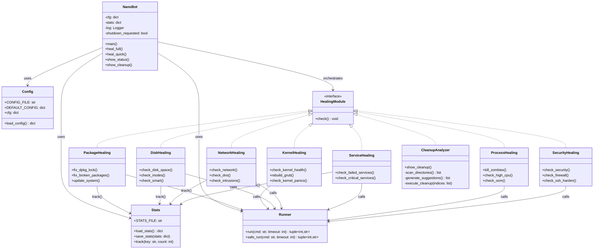
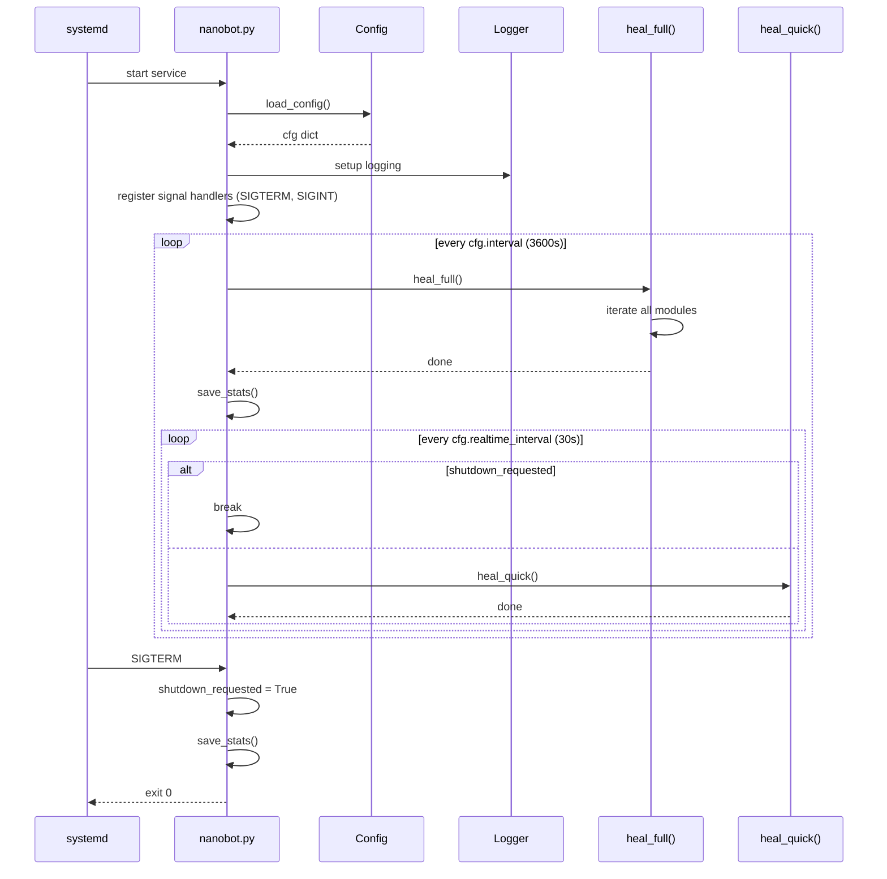
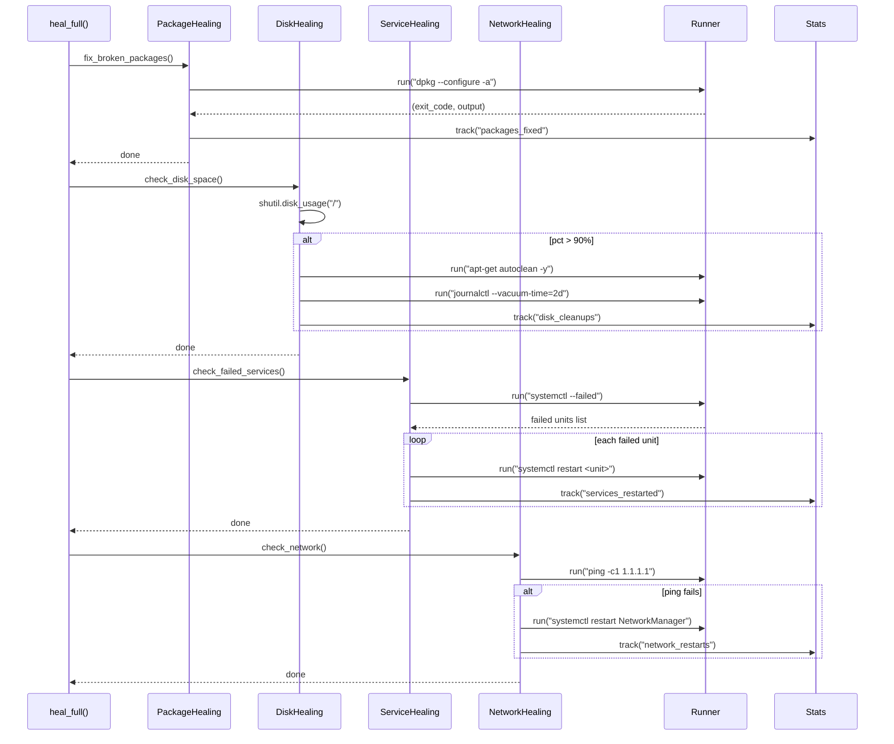
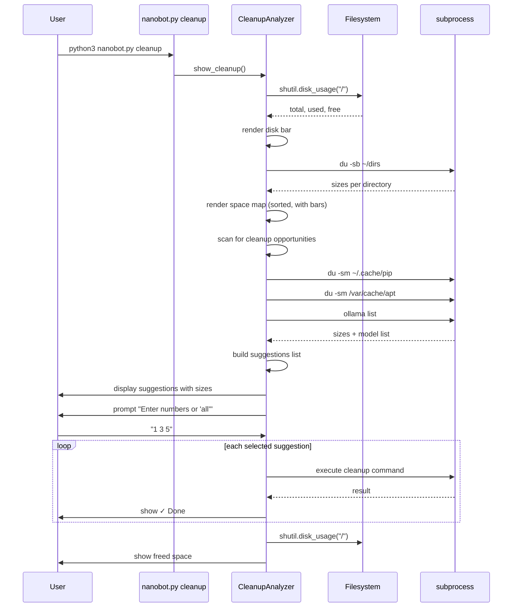
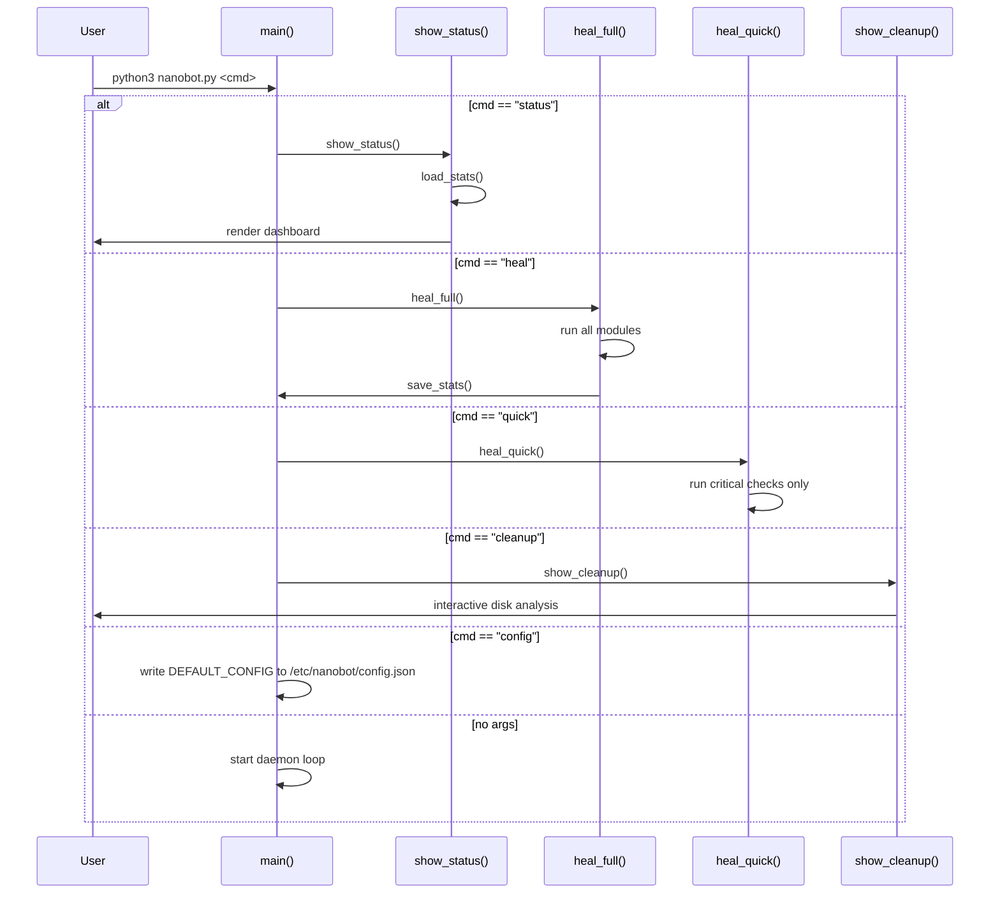

# NanoBots Architecture Design

## Project Tree (proposed modular structure)

```
nanobots/
├── nanobot.py                  # Entry point: CLI dispatch + daemon loop
├── core/
│   ├── __init__.py
│   ├── config.py               # load_config(), DEFAULT_CONFIG, cfg dict
│   ├── stats.py                # load_stats(), save_stats(), track()
│   ├── runner.py               # run(), safe_run() — subprocess wrapper
│   └── log.py                  # Logging setup
├── modules/
│   ├── __init__.py             # Module registry (auto-discovery)
│   ├── packages.py             # fix_dpkg_lock, fix_broken_packages, update_system
│   ├── kernel.py               # check_kernel_health, rebuild_grub, check_kernel_panics
│   ├── gpu.py                  # check_gpu, check_gpu_temp
│   ├── disk.py                 # check_disk_space, check_inodes, check_smart, check_smart_attributes
│   ├── filesystem.py           # check_filesystems, check_fstab, check_mounts
│   ├── services.py             # check_failed_services, check_critical_services
│   ├── processes.py            # kill_zombies, check_high_cpu, check_oom, check_duplicate_processes
│   ├── memory.py               # check_memory, check_swap_usage, check_hugepages
│   ├── thermal.py              # check_thermals, check_fans
│   ├── network.py              # check_network, check_dns, check_intrusions, check_arp_spoof
│   ├── security.py             # check_security, check_firewall, check_ssh_harden, check_apparmor
│   ├── docker.py               # check_docker
│   ├── hardware.py             # check_usb, check_battery, check_firmware, check_cpu_microcode
│   ├── desktop.py              # check_xorg, check_audio, check_bluetooth, check_display_manager
│   ├── systemd.py              # check_systemd_timers, check_systemd_scopes, ...
│   ├── cleanup.py              # show_cleanup (interactive disk analyzer)
│   └── sysctl.py               # check_sysctl, check_tcp_tuning, check_ip_forwarding
├── cli/
│   ├── __init__.py
│   └── commands.py             # status, heal, quick, cleanup, config
├── tests/
│   ├── conftest.py             # Shared fixtures (mock run, mock track)
│   ├── test_packages.py
│   ├── test_disk.py
│   ├── test_network.py
│   ├── test_security.py
│   └── test_cleanup.py
├── docs/
│   ├── README.md               # Documentation index
│   ├── adrs/
│   │   └── adr-001-module-decomposition.md
│   └── designs/
│       ├── architecture.md     # This file
│       └── c4-diagrams.md      # C4 model
├── Makefile
├── pyproject.toml
└── README.md
```

## Class Diagram



## Sequence Diagrams

### Daemon Startup & Main Loop



### Full Healing Cycle



### Interactive Cleanup Flow



### CLI Command Dispatch


