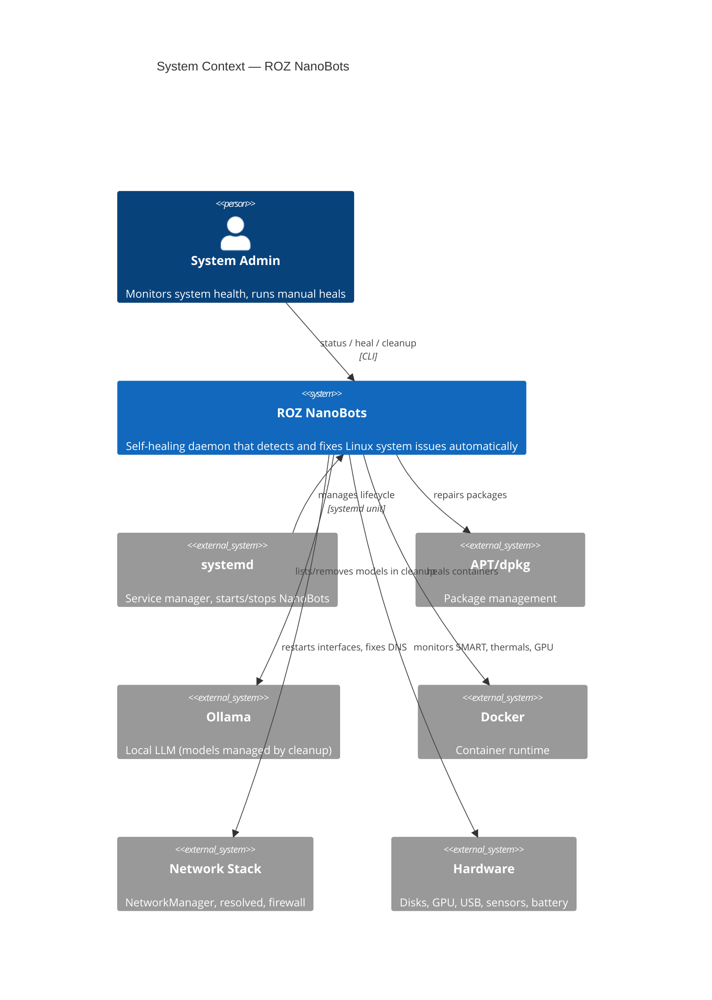
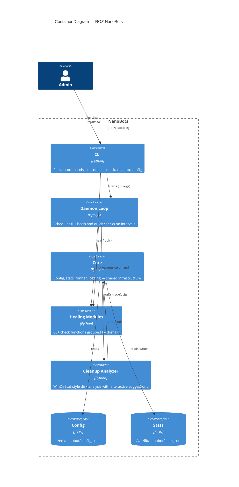
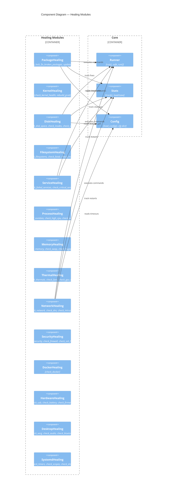
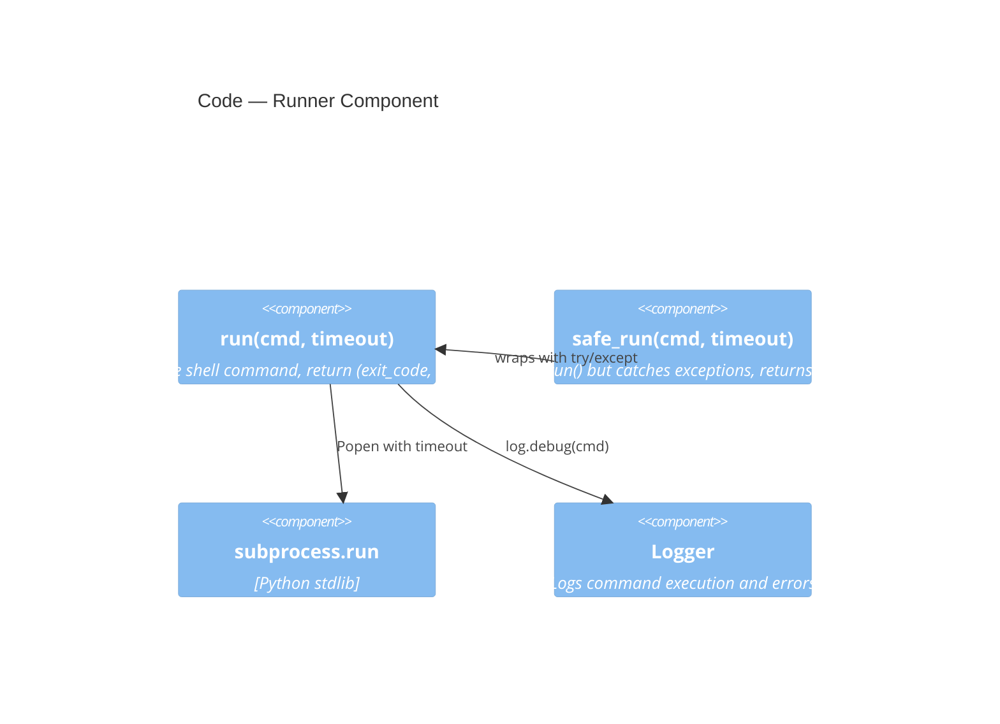
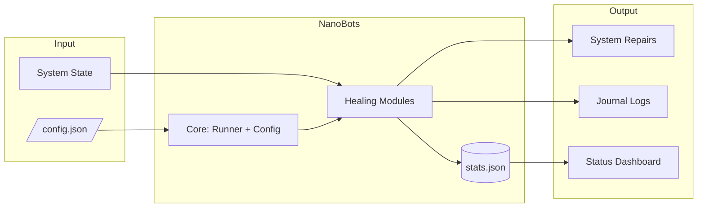

# NanoBots C4 Diagrams

## Level 1: System Context

```mermaid
C4Context
    title System Context — ROZ NanoBots

    Person(admin, "System Admin", "Monitors system health, runs manual heals")

    System(nanobots, "ROZ NanoBots", "Self-healing daemon that detects and fixes Linux system issues automatically")

    System_Ext(systemd, "systemd", "Service manager, starts/stops NanoBots")
    System_Ext(apt, "APT/dpkg", "Package management")
    System_Ext(ollama, "Ollama", "Local LLM (models managed by cleanup)")
    System_Ext(docker, "Docker", "Container runtime")
    System_Ext(network, "Network Stack", "NetworkManager, resolved, firewall")
    System_Ext(hardware, "Hardware", "Disks, GPU, USB, sensors, battery")

    Rel(admin, nanobots, "status / heal / cleanup", "CLI")
    Rel(systemd, nanobots, "manages lifecycle", "systemd unit")
    Rel(nanobots, apt, "repairs packages")
    Rel(nanobots, docker, "heals containers")
    Rel(nanobots, network, "restarts interfaces, fixes DNS")
    Rel(nanobots, hardware, "monitors SMART, thermals, GPU")
    Rel(nanobots, ollama, "lists/removes models in cleanup")
```

## Level 2: Container Diagram

```mermaid
C4Container
    title Container Diagram — ROZ NanoBots

    Person(admin, "Admin")

    Container_Boundary(nb, "NanoBots") {
        Container(cli, "CLI", "Python", "Parses commands: status, heal, quick, cleanup, config")
        Container(daemon, "Daemon Loop", "Python", "Schedules full heals and quick checks on intervals")
        Container(core, "Core", "Python", "Config, stats, runner, logging — shared infrastructure")
        Container(modules, "Healing Modules", "Python", "60+ check functions grouped by domain")
        Container(cleanup, "Cleanup Analyzer", "Python", "WinDirStat-style disk analysis with interactive suggestions")

        ContainerDb(config, "Config", "JSON", "/etc/nanobot/config.json")
        ContainerDb(stats, "Stats", "JSON", "/var/lib/nanobot/stats.json")
    }

    Rel(admin, cli, "invokes", "terminal")
    Rel(cli, daemon, "starts (no args)")
    Rel(cli, modules, "heal / quick")
    Rel(cli, cleanup, "cleanup command")
    Rel(daemon, modules, "orchestrates on timer")
    Rel(modules, core, "run(), track(), cfg")
    Rel(cleanup, core, "run(), shutil")
    Rel(core, config, "reads")
    Rel(core, stats, "reads/writes")
```

## Level 3: Component Diagram

```mermaid
C4Component
    title Component Diagram — Healing Modules

    Container_Boundary(modules, "Healing Modules") {
        Component(pkg, "PackageHealing", "fix_dpkg_lock, fix_broken_packages, update_system")
        Component(kernel, "KernelHealing", "check_kernel_health, rebuild_grub")
        Component(disk, "DiskHealing", "check_disk_space, check_inodes, check_smart")
        Component(fs, "FilesystemHealing", "check_filesystems, check_fstab, check_mounts")
        Component(svc, "ServiceHealing", "check_failed_services, check_critical_services")
        Component(proc, "ProcessHealing", "kill_zombies, check_high_cpu, check_oom")
        Component(mem, "MemoryHealing", "check_memory, check_swap, check_hugepages")
        Component(therm, "ThermalHealing", "check_thermals, check_fans, check_gpu_temp")
        Component(net, "NetworkHealing", "check_network, check_dns, check_intrusions")
        Component(sec, "SecurityHealing", "check_security, check_firewall, check_ssh_harden")
        Component(dock, "DockerHealing", "check_docker")
        Component(hw, "HardwareHealing", "check_usb, check_battery, check_firmware")
        Component(desk, "DesktopHealing", "check_xorg, check_audio, check_bluetooth")
        Component(sysd, "SystemdHealing", "check_timers, check_scopes, check_slices")
    }

    Container_Boundary(core, "Core") {
        Component(runner, "Runner", "run(), safe_run()")
        Component(stats, "Stats", "track(), load/save")
        Component(cfg, "Config", "load_config(), cfg dict")
    }

    Rel(pkg, runner, "executes commands")
    Rel(disk, runner, "executes commands")
    Rel(svc, runner, "executes commands")
    Rel(net, runner, "executes commands")
    Rel(pkg, stats, "track fixes")
    Rel(disk, stats, "track cleanups")
    Rel(svc, stats, "track restarts")
    Rel(net, stats, "track restarts")
    Rel(pkg, cfg, "reads thresholds")
    Rel(disk, cfg, "reads disk_crit_pct")
    Rel(net, cfg, "reads timeouts")
```

## Level 4: Code Diagram (Runner component)

```mermaid
C4Component
    title Code — Runner Component

    Component(run, "run(cmd, timeout)", "Execute shell command, return (exit_code, stdout)")
    Component(safe_run, "safe_run(cmd, timeout)", "Like run() but catches exceptions, returns (1, '')")
    Component(subprocess, "subprocess.run", "Python stdlib")
    Component(log, "Logger", "Logs command execution and errors")

    Rel(run, subprocess, "Popen with timeout")
    Rel(run, log, "log.debug(cmd)")
    Rel(safe_run, run, "wraps with try/except")
```

## Data Flow

```mermaid
flowchart LR
    subgraph Input
        CFG[/config.json/]
        SYS[System State]
    end

    subgraph NanoBots
        CORE[Core: Runner + Config]
        MOD[Healing Modules]
        STATS[(stats.json)]
    end

    subgraph Output
        FIX[System Repairs]
        LOG[Journal Logs]
        DASH[Status Dashboard]
    end

    CFG --> CORE
    SYS --> MOD
    CORE --> MOD
    MOD --> FIX
    MOD --> STATS
    MOD --> LOG
    STATS --> DASH
```
